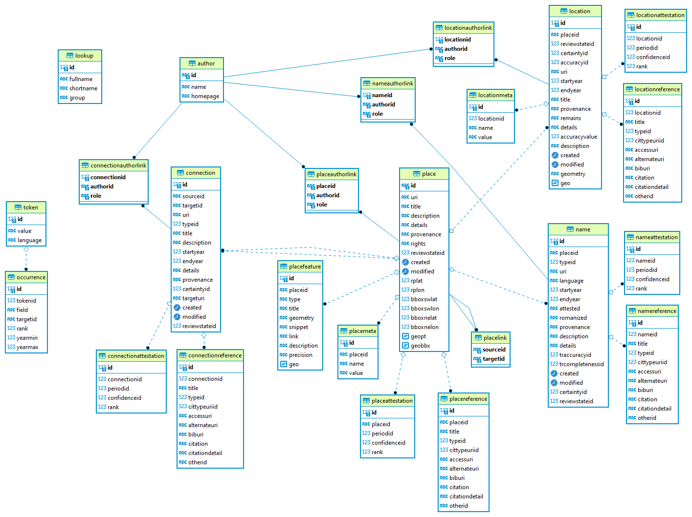

# Pleiades Wrapper API

Thus project includes a CLI tool to import the Pleiades JSON dataset from its full-blown JSON file dump into a specially designed PostgreSQL database; a core search layer; and an API wrapper.

The initial development plan is targeted to a limited set of search functions. A later stage will include more, and eventually extend to other gazetteers where required.

Useful links:

- <www.pleiades.stoa.org>: ancient geography, especially Greek and Roman world. Graph database, no RDBMS. No real API except for getting details from a PID.
- <www.mapbox.com>: the Pleiades site uses MapBox. [Angular MapBox](https://medium.com/@timo.baehr/using-mapbox-in-angular-application-bc3b2b38592).
- [Huge JSON Viewer](https://github.com/WelliSolutions/HugeJsonViewer), [Dadroit JSON Viewer](https://dadroit.com/)

## Quick Start

### Prerequisites

The only prerequisite is having a PostgreSQL service including PostGIS.

To launch a PostgreSQL service without installing it, I prefer to use a ready-made Docker also including [PostGIS](https://postgis.net/install/). You can easily run a container like this (in this sample, I created a folder in my drive at `c:\data\pgsql` to host data outside the container):

```ps1
docker run --volume postgresData://c/data/pgsql -p 5432:5432 --name postgres -e POSTGRES_PASSWORD=postgres -d postgis/postgis
```

>If you already have a PostgreSQL service instance and you want to keep it unchanged, you can just change the container's name and use the same port (stopping the other instance) or a different one (in this case, update the connection string in `appsettings.json`), e.g.: `docker run --volume postgresData://c/data/pgissql -p 5432:5432 --name postgis -e POSTGRES_PASSWORD=postgres -d postgis/postgis`.

### Procedure

💡 During this procedure you will import and progressively enrich data. If you want to take a snapshot at a specific step, just dump the resulting database like:

```bash
pg_dump --username=postgres -f c:/users/dfusi/desktop/dump.sql pleiades
```

If you do not have the pgsql client tool, you can install client tools only from the official package [setup](https://www.enterprisedb.com/downloads/postgres-postgresql-downloads), or for Ubuntu use `sudo apt install postgresql-client`.

Should you want to manually create an empty database (e.g. for restoring tables into it):

```sql
create database pleiades
with owner "postgres"
encoding 'UTF8'
lc_collate='en_US.UTF-8'
lc_ctype='en_US.UTF-8'
template template0;
```

The following procedure will create a database from scratch. You just require:

- the Pleiades JSON [data file](http://atlantides.org/downloads/pleiades/json/).
- the [indexing profile](./pleitool/Assets/Profile.json).
- a running PostgreSQL with PostGis service.

(1) **download** the latest Pleiades JSON dataset from [this page](http://atlantides.org/downloads/pleiades/json/).

(2) ensure that your **database** service is running, and that the connection string in `appsettings.json` is correct.

(3) **import** the JSON file into a database named `pleiades` (you can pick whatever name you want; the database name here is not specified as we're going to use the default `pleiades` name -- you can change it with option `-d` for all the commands involving a database name):

```ps1
./pleitool import-graph c:\users\dfusi\desktop\pleiades-places.json
```

>This process will usually take some minutes, according to your hardware. This is the longest process, as it reads the huge JSON file sequentially. I've not taken care of too complex optimizations here, as I'm not going to use the full import very often (e.g. once a month). You may want to add an import limit (e.g. `-l 100`) to import only a few places and complete the procedure to check it before launching the importer for the full dataset. You can also try with dry mode first, which does not touch the database, by adding the `-p` option.

(4) have the Pleiades [Embix](https://github.com/vedph/embix) **profile** somewhere ready on your machine. You can find it in this repository under `pleitool/Assets`. In this example, I placed it on my Windows desktop with name `pleiades-profile.json`.

(5) create the text **index** inside the database using the Embix profile:

```ps1
./pleitool index c:\users\dfusi\desktop\pleiades-profile.json -c
```

This command provides several options for optimizations and multithreading, but usually a couple of parallel running threads (the default) is fine.

You will find that your `pleiades` database now has two more tables: `eix_token` and `eix_occurrence`.

(6) populate the spatial columns in the `pleiades` database with this command:

```ps1
./pleitool pop-spatial
```

This completes the import procedure.

FYI, the last step just executes the following commands to _populate the spatial columns_ with data parsed from GeoJSON fields, as imported from the original dataset. Notice that the bounding box rectangle is built from SW/NE corners (`POLYGON((bbox_sw_lon bbox_sw_lat, bbox_ne_lon bbox_sw_lat, bbox_ne_lon bbox_ne_lat, bbox_sw_lon bbox_ne_lat, bbox_sw_lon bbox_sw_lat))`):

```sql
-- place
UPDATE place SET geo_pt=ST_Point(rp_lon,rp_lat) WHERE rp_lat<>0;
UPDATE place SET geo_bbx=ST_GeomFromText('POLYGON((' ||
    bbox_sw_lon::varchar || ' ' || bbox_sw_lat::varchar || ',' ||
    bbox_ne_lon::varchar || ' ' || bbox_sw_lat::varchar || ',' ||
    bbox_ne_lon::varchar || ' ' || bbox_ne_lat::varchar || ',' ||
    bbox_sw_lon::varchar || ' ' || bbox_ne_lat::varchar || ',' ||
    bbox_sw_lon::varchar || ' ' || bbox_sw_lat::varchar || '))', 4326);

-- place_feature
UPDATE place_feature SET geometry=NULL WHERE geometry='null';
UPDATE place_feature SET geo=(SELECT st_force2d(ST_GeomFromGeoJSON(geometry))) WHERE geometry IS NOT NULL;

-- location
UPDATE location SET geometry=NULL WHERE geometry='null';
UPDATE location SET geo=(SELECT st_force2d(ST_GeomFromGeoJSON(geometry))) WHERE geometry IS NOT NULL;
```

Note: these queries assume that we're handling the Postgres version of the Pleiades database, where the desired PostGIS extensions have already been introduced with commands like these:

```sql
-- Enable PostGIS (as of 3.0 contains just geometry/geography)
CREATE EXTENSION postgis;
-- enable raster support (for 3+)
CREATE EXTENSION postgis_raster;
-- Enable Topology
CREATE EXTENSION postgis_topology;
-- Enable PostGIS Advanced 3D
-- and other geoprocessing algorithms
-- sfcgal not available with all distributions
CREATE EXTENSION postgis_sfcgal;
```

Other additional packages listed in the above page are not needed:

```sql
-- fuzzy matching needed for Tiger
CREATE EXTENSION fuzzystrmatch;
-- rule based standardizer
CREATE EXTENSION address_standardizer;
-- example rule data set
CREATE EXTENSION address_standardizer_data_us;
-- Enable US Tiger Geocoder
CREATE EXTENSION postgis_tiger_geocoder;
```

This sample code comes from the [PostGIS setup page](https://postgis.net/install/), so please refer to it for updates or more. Anyway, in this procedure you are not required to do anything, because these extensions have already been setup by the JSON importer.

You can now execute typical queries like this:

```sql
SELECT place.id, place.title, place.geo_pt, place_meta.value AS type
FROM
(
  SELECT DISTINCT place.id FROM eix_token
  INNER JOIN eix_occurrence ON eix_occurrence.token_id = eix_token.id
  INNER JOIN place ON eix_occurrence.target_id = place.id
  WHERE eix_occurrence.field in ('plttl','lcttl','nmrmz')
  AND eix_token.value = 'epidauros'
) AS t1
INNER JOIN place ON place.id = t1.id
LEFT JOIN place_meta ON place_meta.place_id = t1.id
  WHERE place_meta.name = 'place-type-uri'
ORDER BY place.title, place.id
LIMIT 20
```

Among other results, you will find [Epidauros](https://pleiades.stoa.org/places/570228/).

Use the `build-query` command of `pleitool` to build SQL queries according to a set of filters.

(7) if you want to create the binary files to be imported by the API, run the export command like:

```ps1
./pleitool export pleiades c:\users\dfusi\desktop\pleiades-bin\
```

## Database Schema

This diagram represents the schema I have designed to contain most of the Pleiades dataset in a RDBMS, for easy usage by a wrapper API.



The database schema represents most of the data from the JSON file, more normalized and compact. Such data are an overkill for a simple geocoding API. Yet, it's often wiser to drop the least amount of data, at least in the import stage, especially for specialized gazetteers like Pleiades. This allows for more growth potential, and also helps in better understanding the model of each resource.

The original model is a graph, where a number of nodes originate from a central node representing a _place_. The node is connected to:

- _location_ nodes, which locate a place in physical space.
- _name_ nodes, which attribute a name to a place.
- _connection_ nodes, which define connections between places.

Also, a number of reference nodes can be assigned to various nodes to represent _references_ and _attestations_.

The RDBMS design represents most of the data in the original set, centered around the _place_ table. This table has a number of connected tables, which represent either the other most important entities (location, names, connections), or some other data, often connected to the place in a one-to-many relationship.

Having no clues about the details of this encoding, the import tool is designed to be easy to modify and adapt to the results of its execution. Its architecture has 3 main components:

- a place _reader_, which reads one place at a time from the JSON dataset file.
- a place _adapter_, which remodels the places read into a form more suitable to the target database.
- a place _writer_, which writes the remodeled places into the target database.

Thus, the same component can be used in different contexts, or eventually be replaced with others, without disrupting the import flow. For instance, the reader is not only used to import data, but also to scan them and get some details about their shape. For instance, this is used to determine the lengths of the various text fields, and their nullability.

Also, in most cases the graph redundancy is systematically reduced also with relation to entity details. For instance, not only in many cases entities have string fields repeating the same value thousands of times (e.g. `published` vs. `pending` for their review state); but often they come in pair, with a full URI value (like `https://pleiades.stoa.org/vocabularies/place-types/settlement`) side by side with its human-friendly, non-unique short form (`settlement`).

In the latter case, the general approach is mapping each URI to a numeric value, stored only once, together with the short form when present. This way, all the references to these URIs will be much more compact _inside_ the database, without losing the corresponding full URI and its eventual short form.

Thus, both the reader and the adapter share a lookup set with those mappings. This not only applies to the URI/short form pairs, but also to all those strings belonging to a rather finite set, like `published` vs. `pending`. In this case, an additional datum in the lookup model is used to group the entries under some specific heading. In the case of review state, the group is `state`, and 2 entries happen to belong to it: one with `published`, and another with `pending`.

For instance, a URI from a RDF vocabulary will look like this:

- ID=`1`
- fullName=`https://pleiades.stoa.org/vocabularies/place-types/settlement`
- shortName=`settlement`
- group=none

Whereas the two sampled entries about review state will be for `published`:

- ID=`7`
- fullName=`published`
- shortName=none
- group=`state`

and, for `pending`:

- ID=`413`
- fullName=`pending`
- shortName=none
- group=`state`

As you can see, the numeric IDs are totally meaningless and their only purpose is providing an internal identifier whithin the boundaries of the database. When dealing with the external world, we will rather output URIs and/or their friendly short names, just like in the original dataset.

## Authentication

Currently the authentication infrastructure is not used, but is in place should we need to limit access to the service.

## Indexing Text for Search

Indexing text for search is implemented directly inside the database, with two additional tables, for the tokens (`eix_token`) and their occurrences (`eix_occurrence`).

As we need to provide a word-based text search, with proper filtering and tokenization, directly inside the database and strictly connected to other data, this project uses my [Embix](https://github.com/vedph/embix) indexing subsystem.

In addition to the basic Embix index, we want some more metadata for each occurrence: rank (calculated from various metadata, like review state, certainty level, etc.) and start/end years. Embix being designed for this type of extension, this project just has to provide these resources:

- an Embix _profile_ (see under project `pleitool/Assets`). This tells Embix which fields from which tables should be indexed, and how each field gets filtered and tokenized. Also, additional metadata for occurrences are defined here.
- a special _filter for languages_. This is specific to Pleiades data, where language codes, where applicable, mostly are inspired by 2-characters ISO 639 codes, but seem to be used with some freedom (e.g. `ca-valencia` besides `ca`, or even `etruscan-in-latin-characters`). So, here a special filter is provided (`LanguageTextFilter`) to flatten these codes into 5-characters codes. Anyway, currently we do not take advantage of this filter as the language datum is not consistent across the dataset; it happens to be specified for names only, so that words taken from other sources have no language specified and thus cannot be compared.
- a _metadata supplier_ (`PleiadesMetadataSupplier`), used to calculate the rank for some data according to their context.
- a _table initializer_, which replaces the default initialization for the occurrence table with one having some additional fields.

Thanks to the usage of this sub-system, we can thus embed a ready-to-use text index with minimal effort.

For Pleiades I currently define 3 Embix documents:

```json
{
  "Documents": [
    {
      "Id": "place",
      "CountSql": "SELECT COUNT(*) FROM place;",
      "DataSql": "SELECT title AS plttl, description AS pldsc, details AS pldtl, review_state_id AS m_state, title AS m_raw_title, id AS m_target_id FROM place ORDER BY place.id LIMIT {1} OFFSET {0};",
      "TextFilterChains": {
        "*": "tag-sep-wsp-std"
      },
      "Tokenizers": {
        "*": "std"
      }
    },
    {
      "Id": "location",
      "CountSql": "SELECT COUNT(*) FROM location;",
      "DataSql": "SELECT title AS lcttl, certainty_id AS m_certainty, review_state_id AS m_state, place_id AS m_target_id FROM location ORDER BY location.id LIMIT {1} OFFSET {0};",
      "TextFilterChains": {
        "*": "tag-sep-wsp-std"
      },
      "Tokenizers": {
        "*": "std"
      }
    },
    {
      "Id": "name",
      "CountSql": "SELECT COUNT(*) FROM name;",
      "DataSql": "SELECT romanized AS nmrmz, attested AS nmatt, description AS nmdsc, start_year AS m_year_min, end_year AS m_year_max, review_state_id AS m_state, romanized AS m_raw_romanized, place_id AS m_target_id FROM name ORDER BY name.id LIMIT {1} OFFSET {0};",
      "TextFilterChains": {
        "*": "tag-sep-wsp-std"
      },
      "Tokenizers": {
        "*": "std"
      },
      "TokenMultipliers": {
        "nmatt": "grc-rom"
      }
    }
  ]
}
```

Here, all data are filtered through a chain including tag filter, separator filter, whitespace filter, and standard filter.

- the `place` document draws data from the `place` table (e.g. "Epidaurus", having Pleiades ID 570228).
- the `location` document draws data from the `location` table (e.g. the location of the theatre in Epidaurus). Location has dates, but these refer to the time span where the location is considered as relevant; so, these are not included in the query metadata, because they do not refer to the time span of the name; and names are all what is found in a text index.
- the `name` document draws data from the `name` table (e.g. Epidaurus has a couple of names: `Epidauria` and `Epidauros`, both spanning from 750 BC to 300 AD). Here dates are taken into account as they refer right to the toponyms, so that a chronological filter here would make sense. Also, note that here I store the non-filtered romanized name, already included in the `nmrmz` field, as a metadatum named `m_rawromanized`. This is because the Pleiades metadata supplier requires the non-filtered value to calculate the rank for the name. In fact, some dubious names happen to be marked with a question mark in this field. When this happens, the rank value (ranging from 0 to 100) gets reduced by 50. This could not be calculated from the filtered name value, where any question mark would be removed.

All these documents will be the source for the list of tokens and occurrences; each occurrence will have its field code equal to one of the following:

- `plttl`: from `place.title`
- `pldsc`: from `place.description`
- `pldtl`: from `place.details`
- `lcttl`: from `location.title`
- `nmrmz`: from `name.romanized`
- `nmdsc`: from `name.description`

The target ID for all the occurrences is always the place ID (as specified by `placeid AS m_targetid` in all the documents).

## Search

Once you have the database filled with data and text index, you can implement whatever search you want. Here I refer to the essential searches currently implemented in this project.

A simple search designed to be quick and easy is focused on the place name. It has these filters (those marked with \* are required):

- text **matching operator**: one among `=` (equal), `<>` (not equal), `*=` (contains), `^=` (starts-with), `$=` (ends-with), `?=` (wildcards: `?`=1 char, `*`=0-N chars), `~=` (regular expression), `%=` (fuzzy search).
- **text**\*: this text is filtered with the standard filter before being submitted.
- **scopes**\*: `plttl`, `pldsc`, `pldtl`, `lcttl`, `nmrmz`, `nmatt`, `nmdsc`. At least 1 must be selected.
- **type**: when specified, can be 1 type from the list: `select value from placemeta where name='place-type-uri' order by value;`.
- **years**: year-min, year-max. These are meaningful only when scope includes `nmrmz`, as this is the only source of years in our Embix documents.
- **rank**: 1-3 (1=75-100; 2=50-75; 3=0-50), or 0=any.
- **geographic**: a point with a minimum and maximum distance from it to the target place (Postgis [ST_Distance](https://postgis.net/docs/ST_Distance.html)); alternatively, a rectangle which should fully contain or intersect the target place (Postgis [ST_Contains](https://postgis.net/docs/ST_Contains.html) or [ST_Intersects](https://postgis.net/docs/ST_Intersects.html)).

Here is a sample query fragment (a "token query", or "t-query" for short in this document) for each token in the input text (for Epidauros 570228):

```sql
with t1 as
(
 select
 -- diagnostic fields (in search we just pick o.targetid)
 t.value, o.target_id, o.field, o.rank, o.year_min, o.year_max,
 pm."name", pm.value, p.geopt
 from token t
 inner join eix_occurrence o on t.id=o.token_id
 inner join place p on o.target_id=p.id
 -- type
 left join place_meta pm on p.id=pm.place_id
 where
 -- text
 t.value ilike 'epidau%'
 -- scope
 and o.field in ('plttl','nmrmz')
 -- years
 and o.year_min < -500
 -- rank
 and o.rank=100
 -- type
 and pm."name"='place-type-uri' and pm.value like '%/settlement'
 -- spatial (distance in mt. from Argos 570106)
 and st_distance
 (
    p.geo_pt::geography,
    st_setsrid(st_point(22.719464, 37.631561), 4326)::geography
 ) < 50000
)
-- for diagnostic purposes just show all the results from t1
select * from t1;
```

Note: casting to geography type is [required](https://stackoverflow.com/questions/8464666/distance-between-2-points-in-postgis-in-srid-4326-in-metres) for distance in meters.

You can then add as many of these t-queries as required, connecting them with `intersect` (for AND) or `union` (for OR), and eventually adding an `order by` clause. The t-queries just return place IDs; you can then join these with all the data you want to return as a result.

## CLI Tool

The import tool is a CLI multi-platform tool, not tied to a specific SQL implementation. Even though both MySql and PostgreSql can be used, for the spatial features I'm using PostgreSql.

### Scan Graph Command

Scan the places graph from the Pleiades JSON file, reporting some metrics about them.

```ps1
./pleitool scan-graph <inputFilePath> <outputDir>
```

Sample:

```ps1
./pleitool scan-graph c:\users\dfusi\desktop\pleiades-places.json c:\users\dfusi\desktop\pd\
```

### Import Graph Command

Import the places graph from the Pleiades JSON file into a target database.

```ps1
./pleitool scan-graph <inputFilePath> [-d databaseName] [-t databaseType] [-p] [-s SkipCount] [-l Limit] [-f Flags]
```

Where:

- inputFilePath: the input JSON file path.
- `-d` the target database name. Default is `pleiades`.
- `-t` the database type. Allowed values are `pgsql` (default) or `mysql`.
- `-p` preflight mode (do not write to database).
- `-s` the place skip count. Default is 0. If set to a number greater than 0, the first N records will be skipped in the import process.
- `-l` the place limit count. Default is 0 (=unlimited, import all places).
- `-f` the import flags: these tell which child nodes of each place should be imported. Each type of child node is represented by a letter, the default value being all children (`FCOLARNMT`):
  - `F` = features
  - `C` = creators
  - `O` = contributors
  - `L` = locations
  - `E` = connections
  - `A` = attestations
  - `R` = references
  - `N` = names
  - `M` = metadata
  - `T` = targetURIs
  - `0` = no child node (use as the only flag)

Sample (try with 10 places without writing to DB):

```ps1
./pleitool import-graph c:\users\dfusi\desktop\pleiades-places.json -l 10 -p -t pgsql
```

### Build Index Command

Syntax:

```ps1
./pleitool index <JsonFilePath> <DatabaseName> [-t <DatabaseType>] [-c] [-p <PartitionCount>] [-s <MinPartitionSize>] [-l <RecordLimit>]
```

- `JsonFilePath` is the path of the JSON profile file for Embix.
- `DatabaseName` is the target database name.
- `-t` the database type. Allowed values are `pgsql` (default) or `mysql`.
- `-c` tells the initializer to truncate the tables if they are found. Otherwise, the command will create them.
- `-p` specifies the number of partitions in which input records are distributed during indexing, thus parallelizing the process. The default value is 2. Use 1 to avoid multiple threads, or higher values for better performance (according to the available hardware).
- `-s` specifies the minimum partition size when using parallelized indexing (default=100). When the total number of records to be indexed for each document is less than this size, no parallelization will occur.
- `-l` specifies an artificial limit for the records to be imported. This can be used for test purposes.

Sample:

```ps1
./pleitool index c:\users\dfusi\desktop\pleiades-profile.json pleiades -t pgsql -c
```

### Validate Geometries Command

This is for PostgreSql only. The command validates spatial features imported from Pleiades: place's coordinates and place's features and locations geometries. Validation is purely formal, i.e. we ensure that longitude is between -180 and +180, latitude is between -90 and +90, and GeoJSON when present can be parsed correctly.

The details about errors (if any) can be found in the log.

Syntax:

```ps1
./pleitool val-geo <DatabaseName>
```

Example:

```ps1
./pleitool val-geo pleiades
```

## Pleiades Overview

### Model

(This is summarized here from the Pleiades docs).

Pleiades content is organized into four types of "information resource":

- **places**: any locus of human attention, material or intellectual, in a real-world geographic context. [Vocabulary of place types](https://pleiades.stoa.org/vocabularies/place-types). Places are entirely abstract, conceptual entities. They are objects of thought, speech, or writing, not tangible, mappable points on the earth's surface. They have no spatial or temporal attributes of their own.
- **locations**: connect places to coordinates in space. A location identifies a specific area of interest on the earth's surface that is associated with a place during a particular date range. A place can contain multiple locations. Locations, on the other hand, are associated with one and only one place.
- **names**: a name reflects the identity of a place in human language, not its physical location in the landscape. Names have no spatial coordinates, but they are always annotated with the time period(s) of the textual source(s) in which they are attested. As with locations, a single place can have multiple names, but an individual name can be associated with one and only one place. This is true even for homonyms.
- **connections**: express and document relationships between different places. They are direct place-to-place relationships allowing the expression of geographic hierarchies, networks, and linkages. [Vocabulary of connection types](https://pleiades.stoa.org/vocabularies/relationship-types).

### Search

The Pleiades site provides a text search for places, names, and locations. It draws upon a text index that incorporates the title, description, details, references, and attested names of Pleiades objects. Advanced search includes:

- basic:
  - text (with AND or OR): matches content, title, description.
  - title
  - description (with AND or OR)
- categorization:
  - match any/all subjects or tags.
  - match any/all feature categories.
- authorship:
  - author (username)
  - contributor (username)
  - provenance (e.g. "Barrington" atlas)
  - cites (items with matching citation, e.g. "Wikipedia")
- geolocation:
  - SW corner in decimal longitude and latitude values (e.g. for Rome 12.5,41.9)
  - NE corner as above, combined to define a box
  - predicate: intersection, distance, nearest
  - distance tolerance in km (decimal)
  - nearest limit (maximum number of uinique distances for nearest)
  - location precision (filter items by their location precision: precise/rough)
- workflow:
  - items added since
  - item type: 1 or more from connection, page, event, location, name, news item, place.
  - review status: 1 or more from drafting, pending, pending review, private, published.

For our primary purpose, the most important search targets geocoding a place name; so it is based on several text fields, eventually combined with tags and spatial data. This project is designed so that we can start with a minimal search, whose first purpose is providing a geocoding service from inside another application, and later expand it at will.

To this end, the first indexing process is very simple: it draws from a set of fields scattered across various tables, all targeting the place entity, like places, features, and locations. Each field is internally identified by a short code like e.g. `plttl`, where `pl` is an abbreviation representing a table name (`place`) and `ttl` an abbreviation representing a field name (`title`) in that table. This allows filtering the search by including or excluding different fields at will.

The indexing process is done using the Embix solution, which is a lightweight tool for embedding a simple words index in a RDBMS. As such, it can be used to collect and index text from several tables and fields, thus providing a simple index to use in conjunction with metadata to implement simple but powerful searches inside textual fields.

### JSON File

The only comprehensive resource (CSV are a subset). Using a JSON viewer, I started with scanning the file looking for patterns. The essential models deduced from thie empirical scan are listed here.

- `Attestation`:

  - timePeriod (string): `mediaeval-byzantine`
  - timePeriodURI: `https://pleiades.stoa.org/vocabularies/time-periods/mediaeval-byzantine`
  - confidence (enum string)
  - confidenceURI (`https://pleiades.stoa.org/vocabularies/attestation-confidence/confident`)

- `Author`:

  - username (string): `jbecker`
  - homepage
  - name: `Jeffrey Becker`
  - uri: author URI like `https://pleiades.stoa.org/author/jbecker`

- `EditAction`:

  - comment (enum string): `Edited`
  - modifiedBy (string): author username
  - modified (date)

- `Feature`:

  - geometry (geoJSON)
  - type
  - id
  - properties:
    - snippet: summary string like `Settlement, ; AD 640 - AD 1453`
    - link (URI string to Pleiades): `https://pleiades.stoa.org/places/48210385/location-of-borgo-medioevale`
    - description
    - location_precision (enum string)
    - title

- `Reference`:
  - shortTitle
  - type: `http://purl.org/spar/cito/citesAsDataSource`
  - citationTypeURI: `http://purl.org/spar/cito/citesAsDataSource`
  - accessURI: `http://www.openstreetmap.org/browse/node/2385554830`
  - alternateURI
  - bibliographicURI
  - formattedCitation: `osm:node=2385554830`
  - citationDetail: `Node 2385554830`
  - otherIdentifier

Here is the tree from the root object:

- **@context** (a few DC metadata)
- **@graph[]**: about 37k entries, each node is a place:
  - @type (enum string)
  - id (int as string?)
  - uri (string): Pleiades URI ID.
  - type (enum string)
  - title
  - description
  - details (may include HTML tags?)
  - provenance
  - rights
  - review_state (enum string)
  - created (date)
  - reprPoint[] (float[]): array of 2 floats for lat/lon.
  - bbox[] (float[]): array of 4 floats for bounding box: SW corner, NE corner.
  - subject[] (enum string[]): `dare:ancient=1`, `dare:feature=major settlement`.
  - _placeTypes[]_ (enum string[])
  - _placeTypeURIs[]_ (string[]): vocabulary
  - _connectsWith[]_ (URI string[]): links to other Pleiades URIs
  - history[] (`EditAction[]`)
  - **creators[]** (`Author[]`)
  - **contributors[]** (`Author[]`)
  - **attestations[]** (`Attestation[]`)
  - **references[]** (`Reference[]`)
  - **features[]** (`Feature[]`)
  - **locations[]**: a set of locations for the place:
    - @type (enum string): `location`
    - id (string): `location-of-borgo-medioevale`
    - uri (string): URI ID, like `https://pleiades.stoa.org/places/48210385/location-of-borgo-medioevale`
    - title
    - description
    - details
    - start (int): start year
    - end (int): end year
    - geometry (geoJSON)
    - review_state (enum string)
    - created (date)
    - archaeologicalRemains (enum string)
    - provenance: `OpenStreetMap (Node 2385554830, version 1, osm:changeset=16964867, 2013-07-15T17:10:57Z)`
    - associationCertainty (enum string)
    - associationCertaintyURI (string): vocabulary URI
    - accuracy (string): URI vocabulary item like `https://pleiades.stoa.org/features/metadata/generic-osm-accuracy-assessment`
    - accuracy_value (float; e.g. `20`)
    - _creators[]_ (`Author[]`)
    - _contributors[]_ (`Author[]`)
    - _attestations[]_ (`Attestation[]`)
    - _references[]_ (`Reference[]`)
    - featureType[]: enum strings (even empty).
    - featureTypeURI[]: array of vocabulary items cited with their full URI like `https://pleiades.stoa.org/vocabularies/place-types`
    - locationType[] (enum string)
    - locationTypeURI[] (string): vocabulary URI
    - history[] (`EditAction[]`)
  - **connections[]**: a set of place-to-place connections for the place:
    - @type (enum string)
    - id (int in a string)
    - uri (URI string)
    - connectionType (enum string)
    - connectionTypeURI: vocabulary: `https://pleiades.stoa.org/vocabularies/relationship-types/succeeds`
    - title
    - description
    - start (int)
    - end (int)
    - details
    - provenance (string)
    - associationCertainty (enum string)
    - connectsTo (URI string): `https://pleiades.stoa.org/places/413005`
    - review_state (enum string)
    - created (date)
    - _attestations[]_ (`Attestation`)
    - _references[]_ (`Reference[]`)
    - _creators[]_ (`Author[]`)
    - _contributors[]_ (`Author[]`)
    - history[] (`EditAction[]`)
  - **names[]** (`Name[]`): a set of names for the place:
    - @type (enum string)
    - id (string): `consabura`
    - uri (string URI)
    - language
    - start (int)
    - end (int)
    - nameType (enum string)
    - attested (string)
    - romanized (string)
    - provenance
    - description
    - details
    - transcriptionAccuracy (enum string)
    - transcriptionCompleteness (enum string)
    - associationCertainty (enum string)
    - associationCertaintyURI: vocabulary
    - review_state (enum string)
    - created (date)
    - _attestations[]_ (`Attestation[]`)
    - _references[]_ (`Reference[]`)
    - _creators[]_ (`Author[]`)
    - _contributors[]_ (`Author[]`)
    - history[] (`EditAction[]`)

## History

- 2023-01-12: upgraded to NET 7.
- 2022-09-18: updated packages.
- 2021-11-09: upgraded to NET 6.
